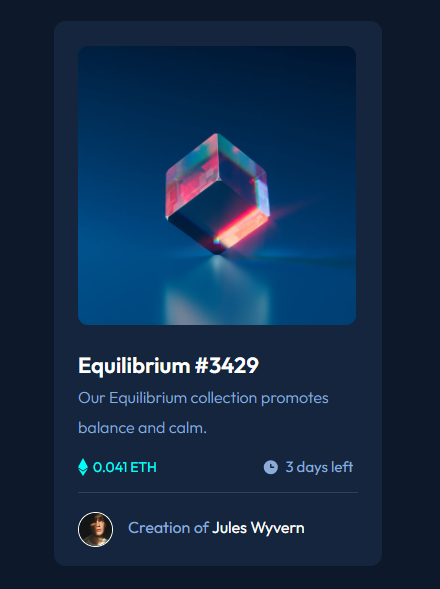

# Frontend Mentor - NFT preview card component solution

This is a solution to the [NFT preview card component challenge on Frontend Mentor](https://www.frontendmentor.io/challenges/nft-preview-card-component-SbdUL_w0U). Frontend Mentor challenges help you improve your coding skills by building realistic projects. 

## Table of contents

- [Overview](#overview)
  - [The challenge](#the-challenge)
  - [Screenshot](#screenshot)
  - [Links](#links)
- [My process](#my-process)
  - [Built with](#built-with)
  - [What I learned](#what-i-learned)
- [Author](#author)

## Overview

### The challenge

Users should be able to:

- View the optimal layout depending on their device's screen size
- See hover states for interactive elements

### Screenshot



### Links

- Solution URL: [solution](https://github.com/IlyasSoe/NFT-Preview-Card.github.io)
- Live Site URL: [live site URL](https://ilyassoe.github.io/NFT-Preview-Card.github.io/)

## My process

### Built with

- Semantic HTML5 markup
- CSS custom properties
- Flexbox


### What I learned

```css
main {
    background-color: var(--veryDarkBlueC);
    border-radius: 12px;
    padding: 25px 24px;
    cursor: pointer;
    height: 545px;
    width: 328px;
}
```

## Author

- Frontend Mentor - [@ilyasSoe](https://www.frontendmentor.io/profile/IlyasSoe)
- linkedin - [ilyas oulianov](https://www.linkedin.com/in/ilyas-oulianov-73241a249)
- Twitter - [@IlyasSoe_](https://twitter.com/IlyasSoe_)
